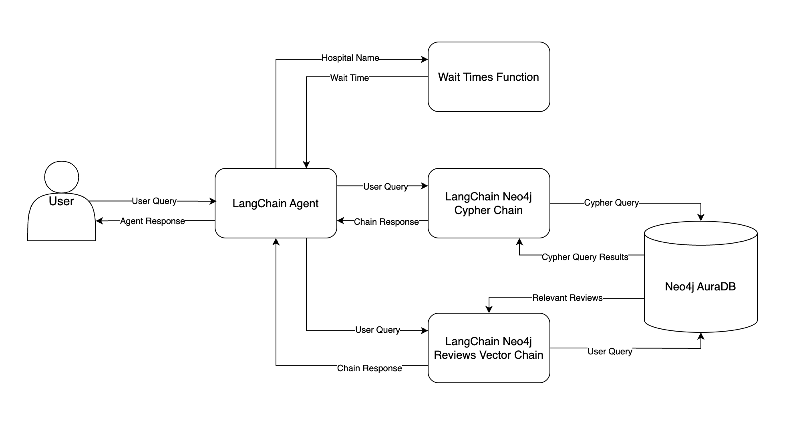

# LLM_RAG_application

## Project Overview

This project aims to develop a chatbot for a hospital system that answers ad-hoc questions about patient data, hospital services, and insurance. The chatbot should seamlessly answer both objective questions (e.g., billing amounts) through dynamic queries and subjective ones (e.g., patient feedback) by analyzing reviews. The chatbot will intelligently determine whether to query a database or analyze documents, providing stakeholders with accurate and timely responses without needing to understand SQL or wait for reports.

## Data Flow in the Chatbot

This flowchart illustrates how data moves through the system, starting from the user’s input query to the final response. Below is a summary of each component:

- **LangChain Agent**: The LangChain agent is the core component of the system. Given a user query, the agent decides which tool to call and what to provide as input. After receiving the tool’s output, the agent determines the appropriate response to return to the user.
  
- **Neo4j AuraDB**: Both structured hospital system data and patient reviews are stored in a Neo4j AuraDB graph database, which is used for querying and analysis.

- **LangChain Neo4j Cypher Chain**: This chain converts the user query into Cypher, Neo4j’s query language, and executes the Cypher query in the database. The results are then used to answer the user query, which is sent back to the LangChain agent and ultimately to the user.

- **LangChain Neo4j Reviews Vector Chain**: Similar to the Cypher Chain, this chain works with patient review embeddings stored in Neo4j. It searches for reviews semantically similar to the user query and uses them to provide an answer.

- **Wait Times Function**: The LangChain agent attempts to extract a hospital name from the query. This name is passed to a Python function that retrieves the current wait times, which are then returned to the agent.

